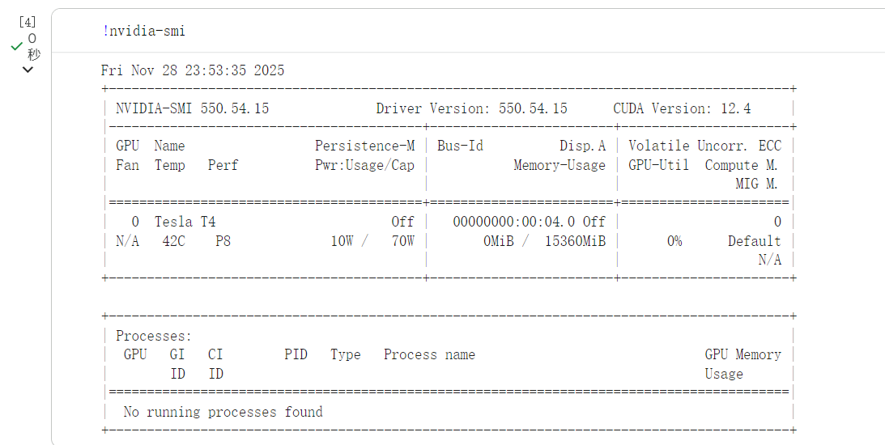

# Controllable-Text-to-Image-System-
### High-Performance Controllable Text-to-Image Generation System (SD/SDXL, LoRA, ControlNet, ONNX/TensorRT Optimization, FastAPI Serving)

This repository contains a **production-grade, controllable text-to-image system** built on  
**Stable Diffusion**, with **LoRA fine-tuning**, **ControlNet conditioning**,  
**high-performance inference (ONNX Runtime/TensorRT)**,  
and a **FastAPI serving layer** with **Prometheus monitoring**.

> ⚡ Designed to bring text-to-image **from research → production**  
> with **fast**, **stable**, **controllable**, and **deployable** generation.

---

# 📌 Table of Contents
- [1. Overview](#-overview)
- [2. Key Features](#-key-features)
- [3. System Architecture](#-system-architecture)
- [4. Quick Start](#-quick-start)
- [5. Demo (UI + API)](#-demo-ui--api)
- [6. Performance](#-performance)
- [7. Training (LoRA)](#-training-lora)
- [8. Controllability (ControlNet)](#-controllability-controlnet)
- [9. Safety & Content Filtering](#-safety--content-filtering)
- [10. Deployment (Docker)](#-deployment-docker)
- [11. Monitoring (Prometheus)](#-monitoring-prometheus)
- [12. Project Roadmap](#-project-roadmap)
- [13. File Structure](#-file-structure)
- [14. License](#-license)

---

# 🔍 Overview

This project builds a **complete AI generation system**, including:

- **Controllable image generation** (ControlNet)
- **Efficient fine-tuning** (LoRA)
- **High-performance inference** (torch.compile + xFormers + ONNX + TensorRT)
- **Production service** (FastAPI)
- **Monitoring & reliability** (Prometheus metrics, concurrency control)
- **User interface** (Gradio)
- **Safety filtering pipeline**

The system supports:

- **CFG / Steps / Seed / Resolution**
- **LoRA weight switching**
- **ControlNet conditioning (Canny / Depth / OpenPose)**
- **Batch generation**
- **ONNX/TensorRT Acceleration**

---

# 🚀 Key Features

### 🧩 **1. Multi-level Controllability**
- ControlNet: Canny / Depth / OpenPose  
- Adjustable control strength  
- CFG scale, inference steps, resolution  

### 🎨 **2. LoRA Fine-tuning Support**
- Plug-and-play LoRA  
- Rank / α ablation  
- Custom style & domain adaptation  

### ⚡ **3. High-Performance Inference**
- `torch.compile()` acceleration  
- xFormers flash attention  
- ONNX Runtime GPU  
- TensorRT FP16/INT8 (optional)  
- Batch & concurrency optimization  

### 🏗️ **4. Production Serving (FastAPI)**
- `/generate` endpoint  
- `/health`  
- `/metrics` (Prometheus format)  
- Internal queue + rate limiting  
- Retry logic  

### 🛡️ **5. Safety Filtering**
- Keyword/regex filter  
- Optional multi-label classifier  
- Structured refusal messages  

### 📊 **6. Monitoring (Prometheus)**
- Latency (P50/P95/P99)  
- Throughput (TPS/RPS)  
- GPU memory  
- Failure rate  

---

# 🏛️ System Architecture


The system consists of:

- **Training Layer** → LoRA/Data Prep  
- **Control Layer** → ControlNet modules  
- **Inference Layer** → PyTorch / ONNX / TensorRT pipelines  
- **Serving Layer** → FastAPI service + queue  
- **UI Layer** → Gradio interface  
- **Evaluation Layer** → CLIPScore/FID + Latency/Throughput tests  
- **Safety Layer** → content filtering + rejection policies  

## Architecture Diagram


# Environment Setup
- GPU: Tesla T4 (via Google Colab)
- CUDA: 12.4
- Frameworks:
    torch==2.x
    diffusers==0.x
    transformers==4.x
    accelerate==0.x


---

# ⚡ Quick Start

## 1. Install Environment
```bash
pip install torch diffusers transformers accelerate xformers
pip install fastapi uvicorn pillow opencv-python
pip install onnxruntime-gpu
pip install gradio
```

## 2. Run Basic SD Inference
python inference/pipeline_pt.py

## 3. Launch Gradio UI
python ui/gradio_app.py

## 4. Start API Server
uvicorn serving.app:app --host 0.0.0.0 --port 8000

🖥️ Demo (UI + API)
✨ Gradio UI

🔌 FastAPI Endpoints
POST /generate
{
  "prompt": "a futuristic city in sunset",
  "steps": 20,
  "cfg_scale": 7.5,
  "controlnet": "canny",
  "strength": 0.8
}

GET /health
{"status": "ok"}

GET /metrics

Prometheus-style metrics.

📈 Performance
🔥 PyTorch Optimized vs ONNX Runtime

Model	Device	Steps	P95 Latency	TPS
PyTorch FP16	
torch.compile + xformers	
ONNX Runtime (FP16)
🧪 Training (LoRA)
Train Your Own LoRA
python training/lora_train.py --config training/config.yaml

Example Results

🎛️ Controllability (ControlNet)
Input → Output Example

🛡️ Safety & Content Filtering
Pipeline

Rules

Keyword filter

Regex rules

Optional multi-label classifier

Structured refusal messages (policy_id, reason)

🐳 Deployment (Docker)
Build
docker build -t t2i .

Run
docker run -p 8000:8000 t2i


📡 Monitoring (Prometheus)

Prometheus exposes:

latency_ms

throughput_rps

gpu_memory_mb

failure_rate


🗺️ Project Roadmap

 SDXL support

 gRPC serving

 TensorRT INT8 pipelines

 LoRA adapter merging

 Real-time A/B human evaluation interface

 HuggingFace Spaces deployment

📁 File Structure
```bash
t2i-controllable-fast
├── training/
│   ├── lora_train.py
│   ├── data_prep.py
│   └── config.yaml
├── control/
│   ├── apply_controlnet.py
│   └── adapters/
├── inference/
│   ├── pipeline_pt.py
│   ├── export_onnx.py
│   └── pipeline_onnx.py
├── serving/
│   ├── app.py
│   ├── queue.py
│   └── monitor.py
├── ui/
│   └── gradio_app.py
├── eval/
│   ├── quality.py
│   ├── latency_throughput.py
│   └── human_eval.md
├── safety/
│   ├── content_filter.py
│   └── policy.yaml
├── docs/
│   ├── architecture_v1.png
│   ├── environment_gpu_t4.png
│   ├── sd15_inference_cat_moon_v1.png
│   ├── gradio_v1.png
│   ├── lora_comparison.png
│   ├── controlnet_canny_comparison.png
│   └── perf_onnx_vs_pt.png
└── README.md
```

🔑 License

MIT License.
Feel free to use, modify, or deploy.
