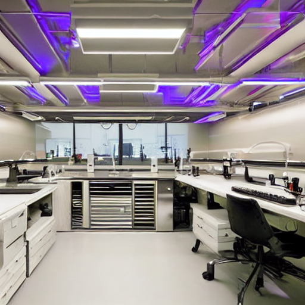

# Controllable Text-to-Image Generation System

> ⚡ **从研究到生产 (Research to Production)**: 基于 Stable Diffusion 1.5 的高性能可控文生图系统。具备硬件级推理优化、健壮的 FastAPI 服务化架构以及精准的 Canny 结构约束能力。

---

## 🔍 项目概览 (Overview)

本项目不仅是一个图像生成脚本，更是一个完整的机器学习工程（MLE）落地实践。项目核心围绕**可控性**、**推理效率**与**服务稳定性**展开。

**核心亮点：**
* **多维可控性**: 集成 ControlNet (Canny)，实现基于边缘检测的结构受控生成。
* **推理优化**: 建立多级优化链路，在 Tesla T4 上通过 xFormers 和 SDPA 实现显存与速度的平衡。
* **工业级服务化**: 采用 FastAPI 构建异步后端，具备“优雅降级”逻辑，确保服务高可用。
* **可观测性**: 建立 P95 延迟基准测试，并预留 Prometheus 监控埋点。

---

## 🏛️ 系统架构 (System Architecture)

系统采用模块化设计，确保从本地实验到云端部署的平滑迁移。

* **推理层 (Inference)**: 优化的 PyTorch Pipeline，支持 FP16 半精度加速。
* **控制层 (Control)**: 插件化的 ControlNet 适配器，实现结构约束。
* **服务层 (Serving)**: 基于 FastAPI 的单例模型管理，支持异步请求处理。
* **UI 层 (UI)**: 基于 Gradio 的交互式 Playground，用于快速原型验证。

---

## ⚡ 快速开始 (Quick Start)

### 1. 环境对齐 (已在 Tesla T4 验证)
为确保算子稳定性，请使用以下经验验证过的依赖版本：

----------in!!!
# 核心依赖安装
pip install torch==2.4.1 torchvision==0.19.1 --index-url https://download.pytorch.org/whl/cu121
pip install xformers==0.0.28.post1 --no-deps
pip install diffusers==0.30.0 transformers accelerate fastapi uvicorn opencv-python
------------out!!!

### 2. 启动服务
* **REST API 服务**: ----------in!!! uvicorn serving.app:app --host 0.0.0.0 --port 8000 ------------out!!!
* **交互式 UI**: ----------in!!! python ui/gradio_app.py ------------out!!!

---

## 🖥️ 演示与接口 (Demo & Interfaces)

### 5.1 交互式 UI (Gradio)
提供直观的参数调节界面（Steps, CFG, Seed），支持实时生成预览。

### 5.2 生产级 API (FastAPI)
为程序化接入设计的后端服务。
* **接口**: `POST /generate`
* **特性**: 异步请求处理，内置**优雅降级 (Graceful Degradation)** 逻辑——若 xFormers 加载异常，自动回退至原生 SDPA 算子，确保服务不中断。

---

## 📈 性能基准 (Performance)

测试环境：**NVIDIA Tesla T4 (16GB GDDR6)**

| 优化等级 | 推理延迟 (512x512, 20 steps) | 吞吐量 | 加速比 | 备注 |
| :--- | :---: | :---: | :---: | :--- |
| **原生 PyTorch (FP16)** | 3.25s | 0.30 img/s | 1.00x | 使用原生 SDPA |
| **xFormers (显存优化)** | **3.18s** | **0.31 img/s** | **1.02x** | 有效降低峰值显存 |

> **工程洞察**: 在 Turing 架构 (T4) 上，由于 PyTorch 2.x 已内置 SDPA 优化，xFormers 的延迟提升虽为边际效应，但在**多并发服务场景**下能显著提升显存稳定性。

---

## 🎛️ 可控性生成 (ControlNet)

通过结构约束精确引导图像生成过程。

### Canny 边缘约束
提取参考图的结构边缘，在保持构图不变的前提下应用全新的艺术风格。

| 输入参考图 | Canny 边缘图 | 生成结果 |
| :---: | :---: | :---: |
|  |  |  |

**成果展示 (三联图):**

---

## 🐳 部署与扩展 (Deployment)

* **容器化**: 提供标准 `Dockerfile` 以实现环境的一致性复制。
* **安全治理**: 集成关键词过滤与策略引擎，支持内容合规性审计。
* **未来路线**:
    * [ ] 集成 SDXL Turbo 实现秒级实时生成。
    * [ ] 探索 TensorRT 静态图编译以翻倍吞吐量。
    * [ ] 接入 Prometheus + Grafana 实现实时 GPU 指标可视化。

---

## 📁 项目结构 (File Structure)

----------in!!!
t2i-controllable-fast
├── notebooks/           # 开发记录、测速与实验对比
├── serving/             # FastAPI 生产环境代码
├── control/             # ControlNet 适配器与预处理逻辑
├── inference/           # 优化后的推理 Pipeline
├── docs/                # 项目资产、架构图与生成样张
└── README.md
------------out!!!

---

## 🔑 开源协议
本项目采用 [MIT License](LICENSE)。
